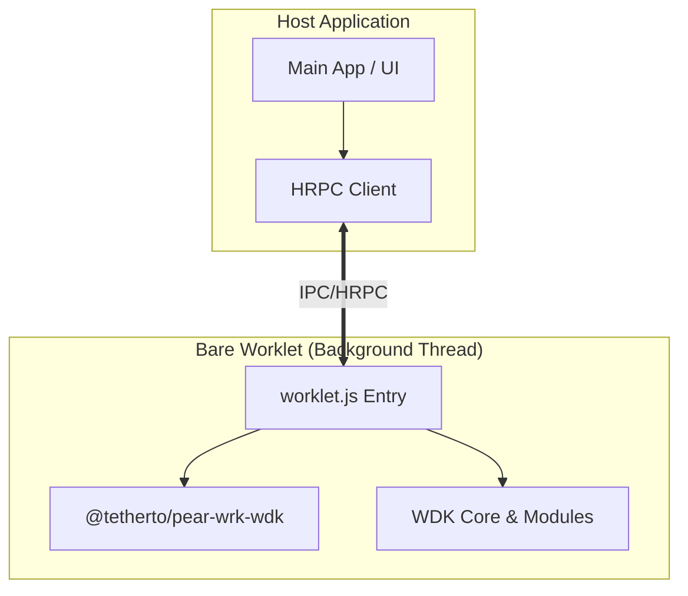

# @tetherto/pear-wrk-wdk

The foundational infrastructure for running the Tether Wallet Development Kit (WDK) inside a **Bare Worklet**.

This package provides the primitives—RPC handlers, lifecycle management, and secure secret storage—to host WDK modules in a separate thread. This architecture allows you to run a full Javascript-based wallet stack anywhere the Bare runtime is embedded (Mobile, Desktop, Server, or Embedded devices) while keeping heavy cryptographic operations isolated from your main application thread.

## What is a Bare Worklet?

A **Bare Worklet** is a lightweight, isolated JavaScript environment (similar to a thread) running within the Bare runtime. Unlike standard Node.js workers, Worklets are designed for the Pear ecosystem to provide high-performance, non-blocking execution contexts.

In the context of a wallet, the Worklet acts as a "security enclave" running in the background. It holds the private keys in memory and performs signing operations, while your main application (the UI) simply sends requests to it.

## Why Use This?

The WDK is written in JavaScript, making it highly portable. However, cryptographic operations and network requests can be resource-intensive.

This package enables a **Worklet Architecture** where:
*   **Write Once, Run Anywhere**: You define your wallet logic (WDK setup) once in JavaScript.
*   **Thread Isolation**: The wallet runs in a dedicated Bare background thread, preventing UI freezes or main-process blocking on any platform.
*   **Secure & Standardized**: It provides a pre-built HRPC (Hyper RPC) bridge to communicate securely between your Host Application and the Wallet Worklet.

## Architecture

This package acts as the infrastructure layer for your worklet, handling the "plumbing" so you can focus on the wallet logic.



## Implementation Guide

While this package provides the core infrastructure, you typically don't need to implement everything manually. We provide high-level tooling to generate the worklet and consume it easily.

### Recommended: Automated Tooling

> **Note**: You likely do not need to install `@tetherto/pear-wrk-wdk` directly. It is a low-level dependency used internally by the higher-level libraries.

1.  **Generate the Worklet**: Install **[`@tetherto/wdk-worklet-bundler`](#)** (usually as a dev dependency). It provides a CLI to automatically generate the worklet entry file based on your WDK modules configuration.
2.  **Connect in your App**: Install **[`@tetherto/wdk-react-native-core`](#)** (or other platform-specific core libraries). This provides ready-to-use hooks to interact with the worklet without needing to manually manage the HRPC connection or the worklet lifecycle.

### Manual Implementation (For Custom Setups)

If you are building a custom integration (e.g., for Desktop, Server, or a custom Bare embedding) and cannot use the pre-built tools, you can implement the architecture manually using the primitives in this package.

#### 1. The Worklet Entry (Background Context)

Create an entry file (e.g., `src/worklet.js`) for your background thread. This file configures *which* WDK modules are available. This script runs inside the Bare worklet environment.

```javascript
/* src/worklet.js */
const { registerRpcHandlers } = require('@tetherto/pear-wrk-wdk/worklet')
const { WDK } = require('@tetherto/wdk')

// Import the specific wallet managers you need
const EvmWalletManager = require('@tetherto/wdk-wallet-evm')
const SparkWalletManager = require('@tetherto/wdk-wallet-spark')

// Define the context
// This tells the infrastructure which modules to expose to the host
const context = {
  WDK, 
  walletManagers: {
    ethereum: EvmWalletManager,
    spark: SparkWalletManager
  },
  protocolManagers: {}, // e.g. AAVE, Uniswap adapters
  requiredNetworks: ['ethereum', 'spark'],
  wdk: null // Initialized via RPC later
}

// Bind the standard WDK RPC handlers to the provided RPC server
module.exports = (rpc) => {
  registerRpcHandlers(rpc, context)
}
```

#### 2. The Host Client (Main Context)

In your main application (whether it's a CLI, a Mobile App, or a Desktop App), you connect to the worklet using the `HRPC` client.

```javascript
const { HRPC } = require('@tetherto/pear-wrk-wdk')
const IPC = require('bare-ipc')

// Initialize the connection to the worklet
// The specific IPC setup depends on how you embed Bare (e.g. bare-kit, pear)
const ipc = new IPC() 
const hrpc = new HRPC(ipc)

// 1. Secrets Management (Happens inside the worklet)
// Generates entropy and encrypts it in memory immediately
const secrets = await hrpc.generateEntropyAndEncrypt({ wordCount: 12 })

// 2. Initialize the WDK
await hrpc.initializeWDK({
  encryptionKey: secrets.encryptionKey,
  encryptedSeed: secrets.encryptedSeedBuffer,
  config: JSON.stringify({
    networks: {
      ethereum: { 
        blockchain: 'ethereum', 
        config: { rpcUrl: 'https://...' } 
      }
    }
  })
})

// 3. Execute Wallet Methods
// The call is serialized, sent to the worklet, executed, and returned
const address = await hrpc.callMethod({
  methodName: 'getAddress',
  network: 'ethereum',
  accountIndex: 0
})
```

## API Reference

### Secrets & Security
*   **`generateEntropyAndEncrypt(wordCount)`**: Generates BIP39 mnemonics and encrypts them immediately in the worklet memory. Returns only the encrypted buffer and key to the host.
*   **`getMnemonicFromEntropy(encryptedEntropy, key)`**: Decrypts and returns the mnemonic.
*   **`getSeedAndEntropyFromMnemonic(mnemonic)`**: Migrates an existing mnemonic into the secure encrypted storage format.

### WDK Lifecycle
*   **`initializeWDK(params)`**: Boots up the WDK instance inside the worklet.
    *   `encryptionKey`: The key to decrypt the seed (returned by `generateEntropyAndEncrypt`).
    *   `encryptedSeed`: The encrypted seed buffer (returned by `generateEntropyAndEncrypt`).
    *   `config`: JSON stringified configuration object (must contain `networks`).
*   **`dispose()`**: Tears down the WDK instance and clears sensitive memory.

### Wallet Interaction
*   **`callMethod(params)`**: The primary gateway for all wallet actions.
    *   `methodName`: The WDK method to call (e.g., `sendTransaction`, `signMessage`).
    *   `network`: The target blockchain (e.g., `ethereum`).
    *   `accountIndex`: The index of the account to use (e.g., `0`).
    *   `args`: Arguments for the method.

### Dynamic Registration
*   **`registerWallet(config)`**: Add support for a new blockchain network at runtime.
*   **`registerProtocol(config)`**: Add support for a new protocol (e.g., DeFi adapter) at runtime.

## License

Apache-2.0